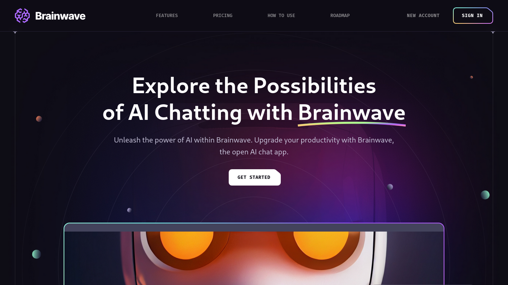

<h1>
  
  Brainwave — AI Landing Page
</h1>


[](https://grep-many.github.io/brainwave/)


[](./LICENSE)

> A modern **AI chatbot landing page** built with **React 19**, **TailwindCSS 4**, and **Vite 7**. Designed to showcase intelligent chatbot features, automation, pricing, and collaboration with a clean, futuristic UI and smooth parallax effects.

---

## ✨ Overview

**Brainwave** is a responsive and visually polished landing page for AI and SaaS products. It focuses on clear product communication through modern layouts, subtle animations, and reusable React components.

You get:

- 🤖 AI-focused product landing page
- 🎨 Clean, modern UI with gradients and SVGs
- 🌊 Smooth parallax animations
- 📱 Fully responsive design
- ⚡ Fast development and builds with Vite

---

## 🖥️ Desktop Preview



---

## 📦 Tech Stack

### **Frontend**

- React 19
- React Router v7
- TailwindCSS 4
- react-just-parallax

### **Developer Tools**

- Vite 7
- ESLint
- Prettier + Tailwind plugin

---

## 📁 Folder Structure

```bash
.
├── public
│   ├── favicons, manifest, icons
├── screenshots
│   └── preview.png
├── src
│   ├── assets
│   │   ├── images, svg, backgrounds
│   │   └── UI illustrations
│   ├── components
│   │   ├── Hero, Benefits, Pricing, Roadmap, Services
│   │   └── Reusable UI components
│   ├── constants
│   │   ├── navigation.js
│   │   ├── benefits.js
│   │   ├── pricing.js
│   │   ├── roadmap.js
│   │   └── socials.js
│   ├── App.jsx
│   ├── index.css
│   └── main.jsx
├── index.html
├── package.json
└── vite.config.js
```

### 🔧 Customization Note

All product content such as **navigation, pricing plans, benefits, roadmap items, and social links** can be easily modified from the `src/constants/` directory without touching UI components.

---

## 🛠️ Getting Started

```bash
git clone https://github.com/grep-many/brainwave.git
cd brainwave
npm install
npm run dev
```

---

## 🚀 Features

- AI chatbot–oriented landing experience
- Modular component-based architecture
- Pricing, roadmap, and service sections
- Responsive and scalable design
- Optimized for performance

---

## 🪪 License

[](./LICENSE)
